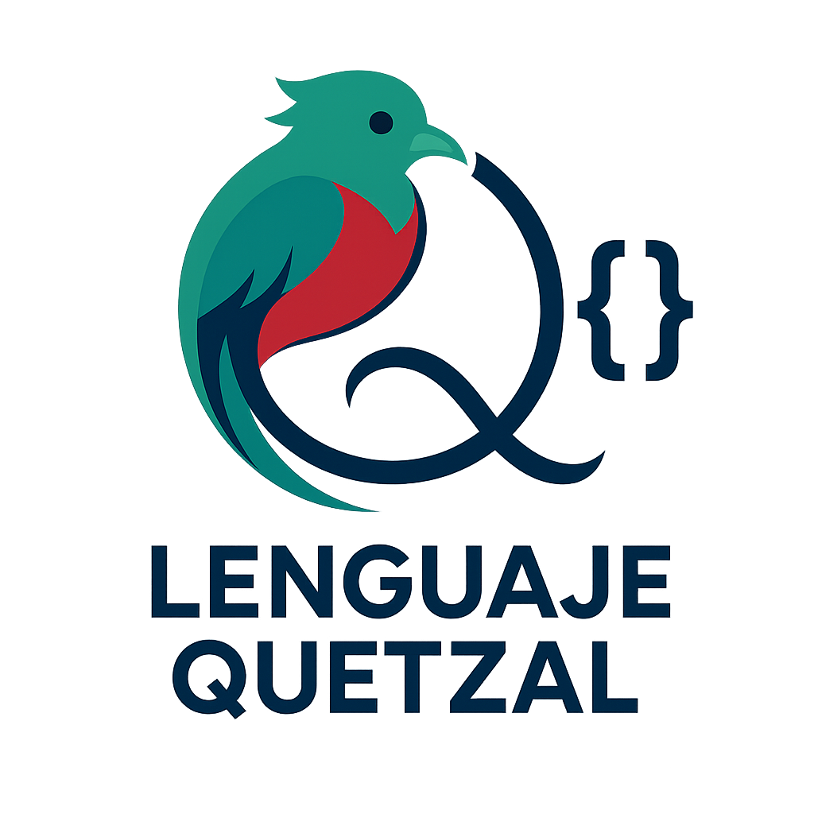
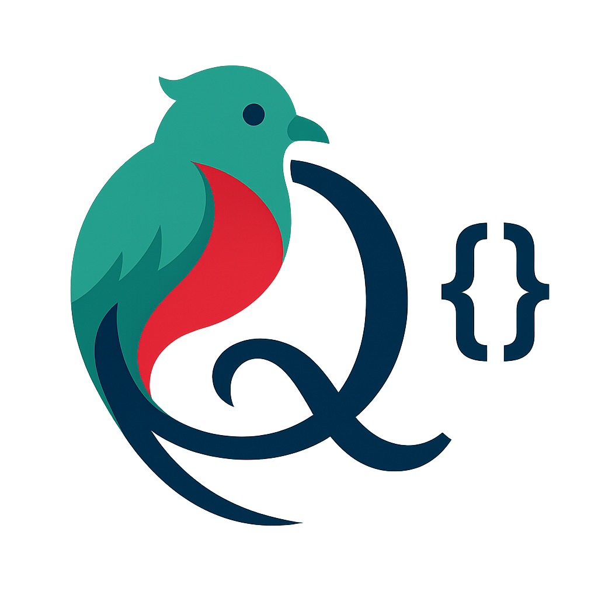

<div align="center">
  
  
  # Lenguaje Quetzal
  
  **Un lenguaje de programación interpretado completamente en español**
  
  [](https://www.rust-lang.org/)
  [](https://github.com/AntaresGT/lenguaje-quetzal)
  [](https://marketplace.visualstudio.com/items?itemName=AntaresGT.lenguaje-quetzal-vscode-extension)
  [](https://marketplace.visualstudio.com/items?itemName=AntaresGT.lenguaje-quetzal-vscode-extension)
</div>

---

## 📖 Descripción

**Lenguaje Quetzal** es un lenguaje de programación interpretado diseñado completamente en español, desarrollado en Rust para ofrecer alto rendimiento y confiabilidad. Su objetivo es hacer la programación más accesible para hispanohablantes mediante una sintaxis natural y palabras clave en español.

> 🎯 **Misión**: Crear un lenguaje de programación en español y que sea totalmente funcional para proposito general, no únicamente para enseñanza.

> 🚀 **Visión a corto plazo**: Que Lenguaje Quetzal se convierta en una herramienta capaz de ejecutarse en un servidor para responder peticiones y ejecutar código en tiempo real, facilitando el desarrollo de aplicaciones web y servicios backend.

> 🌱 **Motivación**: La programación no tiene fronteras, pero sí puede tener raíces. Quetzal busca ofrecer a la comunidad hispanohablante con un lenguaje moderno, seguro, eficiente y totalmente en español, permitiendo a los desarrolladores hispanohablantes crear aplicaciones de manera más intuitiva y natural. Además de facilitar la enseñanza de conceptos de programación a quienes tienen el español como lengua materna.

> **Nota**: No veas Quetzal como un lenguaje de programación para principiantes, sino como una herramienta poderosa que puede ser utilizada por desarrolladores experimentados para crear aplicaciones robustas y eficientes. Actualmente en su versión 0.0.1, Quetzal ya cuenta con un intérprete funcional y una extensión para Visual Studio Code que mejora la experiencia de desarrollo.


### 📊 Estadísticas del Proyecto

- 📝 **Líneas de código**: ~2,000+ líneas de Rust
- 🧪 **Archivos de prueba**: 13 suites de pruebas completas
- 🚀 **Rendimiento**: Interpretación rápida con validación en tiempo de compilación
- 🎨 **Extensión VS Code**: Soporte completo para desarrollo

### ✨ Características Principales

- 🇪🇸 **Sintaxis en español**: Todas las palabras clave y conceptos en español
- ⚡ **Alto rendimiento**: Intérprete desarrollado en Rust para máximo rendimiento
- 🔧 **Tipado fuerte**: Sistema de tipos robusto y seguro que previene errores
- 📋 **JSON nativo**: Compatibilidad directa con estructuras JSON sin librerías adicionales
- 🎯 **Sintaxis clara**: Diseñado para ser fácil de leer y escribir
- 🔄 **Funciones asíncronas**: Soporte completo para programación asíncrona moderna
- 🎨 **Salida colorizada**: Funciones de consola con colores para mejor experiencia
- 📝 **Validación estricta**: Nombres de variables en camelCase o snake_case
- 🚫 **Palabras reservadas protegidas**: Prevención automática del uso de palabras reservadas

---

## 🚀 Instalación

### Prerrequisitos
- [Rust](https://rustup.rs/) (versión 1.70 o superior)
- Git

### Compilar desde código fuente

```bash
# Clonar el repositorio
git clone https://github.com/AntaresGT/lenguaje-quetzal.git
cd lenguaje-quetzal

# Compilar el proyecto
cargo build --release

# Ejecutar un archivo
cargo run archivo.qz
```

---

## 🛠️ Extensión para VS Code

<div align="center">
  <a href="https://marketplace.visualstudio.com/items?itemName=AntaresGT.lenguaje-quetzal-vscode-extension">
    
  </a>
  <br>
  
  
</div>

Mejora tu experiencia de desarrollo con la **extensión oficial** para Visual Studio Code que incluye:

- 🎨 **Resaltado de sintaxis** completo para archivos `.qz`
- 📝 **Autocompletado inteligente** de palabras clave y funciones
- 🔍 **Detección de errores** en tiempo real con validación de sintaxis
- 🎯 **Snippets de código** para acelerar el desarrollo
- 📁 **Iconos personalizados** temáticos para archivos Quetzal
- 🌟 **Temas de colores** optimizados para la sintaxis española
- 🔧 **Configuración automática** del entorno de desarrollo

### � Instalación Rápida

```bash
# Desde la línea de comandos
code --install-extension AntaresGT.lenguaje-quetzal-vscode-extension
```

**[👉 Instalar desde Marketplace](https://marketplace.visualstudio.com/items?itemName=AntaresGT.lenguaje-quetzal-vscode-extension)**

---

## 💻 Sintaxis y Ejemplos

### Variables y Tipos de Datos

```qz
// Tipos básicos
entero edad = 25
número precio = 99.99
cadena nombre = "María García"
bool activo = verdadero

// Listas
lista<entero> numeros = [1, 2, 3, 4, 5]
lista<cadena> colores = ["rojo", "verde", "azul"]

// JSON nativo
jsn persona = {
    nombre: "Juan Pérez",
    edad: 30,
    activo: verdadero,
    hobbies: ["programar", "leer", "viajar"]
}
```

### Funciones

```qz
// Función simple
entero sumar(entero a, entero b) {
    retornar a + b
}

// Función sin retorno
vacio saludar(cadena nombre) {
    imprimir("¡Hola " + nombre + "!")
}

// Función asíncrona
asincrono cadena obtener_datos(cadena url) {
    // Código asíncrono
    retornar "Datos obtenidos"
}
```

### Control de Flujo

```qz
// Condicionales
si (edad >= 18) {
    imprimir("Es mayor de edad")
} sino {
    imprimir("Es menor de edad")
}

// Bucles
para (entero i = 1; i <= 10; i++) {
    imprimir("Número: " + i.cadena())
}

mientras (condicion) {
    // Código del bucle
}

// Foreach
para (cadena color en colores) {
    imprimir("Color: " + color)
}
```

### Funciones de Consola

```qz
// Salida básica
imprimir("Mensaje normal")

// Salida con colores
imprimir_error("❌ Error: Algo salió mal")
imprimir_advertencia("⚠️ Advertencia: Revisa este valor")
imprimir_exito("✅ Operación completada exitosamente")
imprimir_informacion("ℹ️ Información importante")
```

### Ejemplo Completo: Calculadora

```qz
// Programa de calculadora básica
cadena operacion = "suma"
entero num1 = 10
entero num2 = 5

entero calcular(cadena op, entero a, entero b) {
    si (op == "suma") {
        retornar a + b
    } sino si (op == "resta") {
        retornar a - b
    } sino si (op == "multiplicacion") {
        retornar a * b
    } sino si (op == "division") {
        si (b != 0) {
            retornar a / b
        } sino {
            imprimir_error("Error: División por cero")
            retornar 0
        }
    } sino {
        imprimir_advertencia("Operación no válida")
        retornar 0
    }
}

// Usar la función
entero resultado = calcular(operacion, num1, num2)
imprimir_exito("Resultado: " + resultado.cadena())
```

### Manejo de Datos JSON

```qz
// Crear objeto JSON
jsn configuracion = {
    aplicacion: "MiApp",
    version: "1.0.0",
    configuraciones: {
        tema: "oscuro",
        idioma: "español",
        notificaciones: verdadero
    },
    modulos: ["auth", "database", "api"]
}

// Acceder a propiedades
cadena tema = configuracion.configuraciones.tema
imprimir("Tema actual: " + tema)

// Iterar sobre lista
para (cadena modulo en configuracion.modulos) {
    imprimir_informacion("Módulo cargado: " + modulo)
}
```

---

## 🆚 ¿Por qué Quetzal?

| Característica | Quetzal | Python | JavaScript |
|----------------|---------|--------|------------|
| 🇪🇸 Sintaxis en español | ✅ | ❌ | ❌ |
| ⚡ Rendimiento | 🔥 Alto (Rust) | 🐌 Medio | 🚀 Variable |
| 🔧 Tipado fuerte | ✅ | ❌ | ❌ |
| 📋 JSON nativo | ✅ | ❌ | ✅ |
| 🎯 Simplicidad | ✅ | ✅ | ❌ |
| 🔄 Async/await | ✅ | ✅ | ✅ |

---

## 📁 Estructura del Proyecto

```
lenguaje-quetzal/
├── 📁 src/                    # Código fuente del intérprete
│   ├── 🦀 principal.rs        # Punto de entrada
│   ├── 🦀 interprete.rs       # Lógica principal del intérprete
│   ├── 🦀 valores.rs          # Tipos de datos y valores
│   ├── 🦀 entorno.rs          # Manejo de variables y funciones
│   ├── 🦀 consola.rs          # Funciones de salida con colores
│   └── 🦀 objetos.rs          # Estructuras de objetos
├── 📁 pruebas/                # Archivos de prueba
│   ├── 🐦 prueba-tipos.qz     # Pruebas de tipos de datos
│   ├── 🐦 prueba-funciones.qz # Pruebas de funciones
│   ├── 🐦 prueba-bucles.qz    # Pruebas de bucles
│   └── 🐦 ...                 # Más archivos de prueba
├── 📁 imagenes/               # Logos e iconos
└── 📄 README.md               # Este archivo
```

---

## 🧪 Ejecutar Pruebas

El proyecto incluye una suite completa de pruebas para validar todas las características:

```bash
# Ejecutar todas las pruebas
cargo run pruebas/prueba-maestro.qz

# Ejecutar pruebas específicas
cargo run pruebas/prueba-tipos.qz
cargo run pruebas/prueba-funciones.qz
cargo run pruebas/prueba-bucles.qz
cargo run pruebas/prueba-condicionales.qz
cargo run pruebas/prueba-json.qz
cargo run pruebas/prueba-operadores.qz
cargo run pruebas/prueba-listas.qz
cargo run pruebas/prueba-conversiones.qz
```

---

## 🗺️ Hoja de Ruta

### v0.0.1 (Actual) ✅
- [x] Intérprete básico en Rust
- [x] Tipos de datos fundamentales
- [x] Funciones definidas por el usuario
- [x] Control de flujo (si/sino, bucles)
- [x] Soporte JSON nativo
- [x] Sistema de tipos fuerte
- [x] Extensión VS Code

### v0.0.2 (Próximamente)
- [ ] Sistema de módulos (`importar/exportar`)
- [ ] Manejo de excepciones (`intentar/atrapar/finalmente`)
- [ ] Herencia multiple
- [ ] Funciones asíncronas completas
- [ ] Operadores avanzados
- [ ] REPL interactivo

### v0.1.0 (Futuro)
- [ ] Librerías estándar
- [ ] Gestión de paquetes
- [ ] Debugger integrado
- [ ] Facilidad para crear aplicaciones de servidor como API REST
- [ ] Conexión a bases de datos
- [ ] Herramientas de desarrollo

### v0.2.0 (Futuro lejano)
- [ ] Soporte con Floem para crear aplicaciones de escritorio y móviles (en duda XD)
- [ ] Soporte para crear aplicaciones web con Quetzal
- [ ] Computación gráfica avanzada con Quetzal

---

## 🤝 Contribuir

¡Las contribuciones son bienvenidas! Si quieres contribuir al proyecto:

1. 🍴 Haz un fork del repositorio
2. 🌟 Crea una rama para tu característica (`git checkout -b nueva-caracteristica`)
3. 💻 Realiza tus cambios y pruebas
4. 📝 Commit tus cambios (`git commit -am 'Agregar nueva característica'`)
5. 📤 Push a la rama (`git push origin nueva-caracteristica`)
6. 🔄 Abre un Pull Request

### 📋 Guías de Contribución

- Mantén el código en español (comentarios, variables, funciones)
- Sigue las convenciones de nomenclatura del proyecto
- Incluye pruebas para nuevas características
- Actualiza la documentación según sea necesario

---

## ❓ Preguntas Frecuentes (FAQ)

### ¿Es Quetzal un lenguaje compilado o interpretado?
Quetzal es un lenguaje **interpretado** con validación estática. Esto significa que el código se ejecuta directamente sin necesidad de compilación previa, pero se valida la sintaxis y tipos antes de la ejecución.

### ¿Puedo usar nombres de variables en inglés?
Sí, puedes usar nombres de variables en cualquier idioma, siempre que sigan las convenciones **camelCase** o **snake_case**. Sin embargo, las palabras clave deben estar en español.

### ¿Qué tan rápido es Quetzal comparado con otros lenguajes?
Gracias a que está implementado en Rust, Quetzal ofrece excelente rendimiento, especialmente en operaciones de procesamiento de datos y cálculos numéricos.

### ¿Hay soporte para librerías externas?
Actualmente estamos trabajando en el sistema de módulos. La v0.1.0 incluirá soporte para importar librerías externas.

---

## 📞 Contacto y Soporte

- 🐛 **Reportar bugs**: [Issues en GitHub](https://github.com/AntaresGT/lenguaje-quetzal/issues)
- 💡 **Solicitar características**: [Feature Requests](https://github.com/AntaresGT/lenguaje-quetzal/issues/new)
- 💬 **Discusiones**: [GitHub Discussions](https://github.com/AntaresGT/lenguaje-quetzal/discussions)
- 📧 **Email**: alan@antaresgt.com
- 🌐 **Sitio web**: [lenguaje-quetzal.com](https://lenguaje-quetzal.antaresgt.com.org)

---

<div align="center">
  <h3>🚀 ¡Únete a la Revolución de la Programación en Español! 🚀</h3>
  
  <p><strong>Hecho con ❤️ para la comunidad hispanohablante</strong></p>
  
  <p>
    <a href="https://marketplace.visualstudio.com/items?itemName=AntaresGT.lenguaje-quetzal-vscode-extension">📦 Extensión VS Code</a> •
    <a href="#-sintaxis-y-ejemplos">📖 Documentación</a> •
    <a href="#-ejecutar-pruebas">🧪 Pruebas</a> •
    <a href="#-contribuir">🤝 Contribuir</a> •
    <a href="#-preguntas-frecuentes-faq">❓ FAQ</a>
  </p>
  
  <div style="margin: 20px 0;">
    
  </div>
  
  <p>
    <em>"La programación no tiene fronteras, pero sí puede tener raíces"</em>
  </p>
  
  <p>
    <a href="https://github.com/AntaresGT/lenguaje-quetzal/stargazers">⭐ ¡Dale una estrella si te gusta el proyecto!</a>
  </p>
</div>