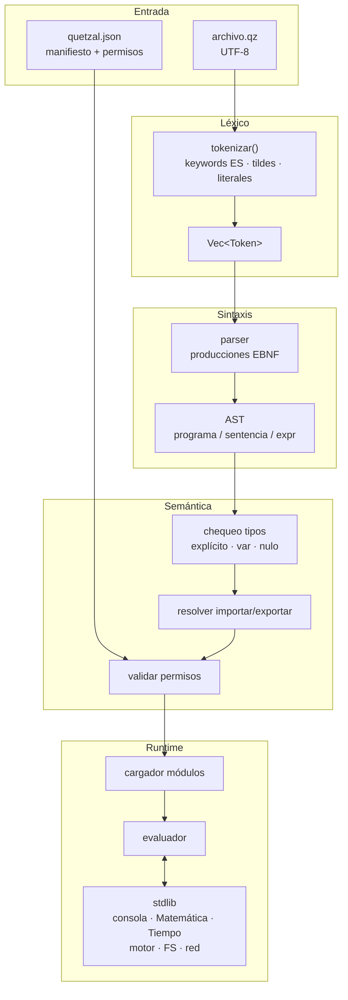

# Definición del Lenguaje Quetzal

Especificación **humana + IA + máquina** de Quetzal.
Si el contexto se pierde, restaurar desde: [`identidad.md`](./identidad.md) + [`catalogo.json`](./catalogo.json) + [`gramatica.json`](./gramatica.json).

| Artefacto | Rol |
|---|---|
| [`identidad.md`](./identidad.md) | Qué es Quetzal (canónico) |
| [`catalogo.json`](./catalogo.json) | Inventario features/API (machine-readable) |
| [`arquitectura.md`](./arquitectura.md) | Crates + pipeline del intérprete (Rust) |
| [`gramatica.json`](./gramatica.json) | Gramática para parsers/IA |
| [`gramatica.ebnf.md`](./gramatica.ebnf.md) | Gramática EBNF legible |
| [`esquema_quetzal.json`](./esquema_quetzal.json) | Schema de `quetzal.json` |
| Docs `.md` | Detalle por característica |
| [`anomalias.md`](./anomalias.md) | Inconsistencias conocidas |

---

## 0. Grafo: cómo se mueve la sintaxis



Detalle railroad por producción: [`diagramas.md`](./diagramas.md).

### Grafo de decisión de sentencia

```mermaid
flowchart LR
    S((sentencia)) --> D{forma}
    D -->|tipo var? id =| DECL[declaración]
    D -->|lvalue op=| ASIG[asignación]
    D -->|si mientras para intentar| CTRL[control]
    D -->|objeto prototipo| POO[definición]
    D -->|importar exportar| MOD[módulo]
    D -->|tipo nombre(| FN[función]
    D -->|expr| EXP[expresión]
```

---

## 1. Resumen ejecutivo

Quetzal =

- **Español** — keywords y API naturales
- **Tipado estático explícito** — sin inferencia
- **Inmutable por defecto** — `var` muta
- **POO** — `objeto` / `prototipo` / `hereda` / `libre`
- **Async** — `asincrono` / `esperar`
- **Excepciones** — `intentar` / `capturar` / `finalmente` / `lanzar`
- **Módulos** — `importar` / `exportar`
- **Templates** — `t"hola {nombre}"`
- **Stdlib ES** — consola, matemática, tiempo, regex, FS, red
- **Seguro por defecto** — permisos en manifiesto

---

## 2. Catálogo de características

Formato fijo por feature:

- **Objetivo** — para qué existe
- **Funciones** — capacidades / keywords
- **Funciones de la API** — métodos/símbolos públicos

### 2.1 Tipos

#### tipo `entero`
- **Objetivo:** i64 con signo; conteos, índices, aritmética exacta.
- **Funciones:** literales `42`, ops `+ - * / %`, comparación, `nulo`.
- **Funciones de la API:** `texto()`, `logico()`, `absoluto()`, `entero()`, `numero()` / `número()`.

#### tipo `número` / `numero`
- **Objetivo:** IEEE 754 double.
- **Funciones:** literales `3.14`, mismas ops numéricas.
- **Funciones de la API:** `texto()`, `logico()`, `absoluto()`, `entero()`, `numero()` / `número()`.

#### tipo `texto`
- **Objetivo:** Unicode UTF-8; interpolación `t"…"`.
- **Funciones:** `"…"`, `t"{expr}"`, `+`, índice `[i]` / `[-1]`.
- **Funciones de la API:** ver [`metodos-nativos.md`](./metodos-nativos.md) §1 (`longitud`, `reemplazar`, `dividir`, conversiones, base64, URL, …).

#### tipo `log`
- **Objetivo:** booleano.
- **Funciones:** `verdadero` / `falso`; `&&` `||` `!` (también `y` `o` `no` en lexer).
- **Funciones de la API:** `texto()`.

#### tipo `vacío` / `vacio`
- **Objetivo:** retorno sin valor.
- **Funciones:** anotación de función; `retornar` vacío.
- **Funciones de la API:** — (ninguna).

#### tipo `lista` / `lista<T>`
- **Objetivo:** arreglo ordenado; tipado o heterogéneo.
- **Funciones:** `[…]`, índice, `para … en|cada`, mutación si `var`.
- **Funciones de la API:** §2 de [`metodos-nativos.md`](./metodos-nativos.md); global `rango(a, b)`.

#### tipo `jsn`
- **Objetivo:** objeto JSON nativo.
- **Funciones:** `{ k: v }`, acceso `.` / `[]`.
- **Funciones de la API:** `contiene_clave`, `claves`, `valores`, `establecer`, `eliminar`, `fusionar`, `texto`, `texto_formateado`, `jsn`.

#### tipo `funcion`
- **Objetivo:** callbacks de primera clase (solo nombres; sin lambdas).
- **Funciones:** parámetro `funcion`, `Objeto.metodo`, `instancia.metodo` enlazado.
- **Funciones de la API:** invocación `(args)`.

#### valor `nulo`
- **Objetivo:** ausencia polimórfica.
- **Funciones:** asignable a cualquier tipo.
- **Funciones de la API:** — .

#### mutabilidad `var`
- **Objetivo:** reasignación explícita.
- **Funciones:** `tipo var nombre = expr`; parámetros `var`.
- **Funciones de la API:** — .

Detalle: [`tipos.md`](./tipos.md).

### 2.2 Control de flujo

#### `si` / `sino si` / `sino`
- **Objetivo:** ramificación; `()` y `{}` obligatorios.
- **Funciones:** cadena `si` → `sino si` → `sino`; ternario `? :`.
- **Funciones de la API:** — .

#### bucles
- **Objetivo:** repetición.
- **Funciones:** `mientras`, `hacer…mientras`, `para(;;)`, `para (T var x en|cada coll)`, `romper`, `continuar`.
- **Funciones de la API:** — .

#### excepciones
- **Objetivo:** errores capturables.
- **Funciones:** `intentar` / `capturar (excepcion e)` / `finalmente` / `lanzar`.
- **Funciones de la API:** `e.mensaje`, `e.llamadas`.

Detalle: [`control-flujo.md`](./control-flujo.md).

### 2.3 Funciones

#### funciones
- **Objetivo:** procedimientos tipados.
- **Funciones:** `[asincrono] tipo nombre(params) {…}`, `retornar`, recursión, `esperar`.
- **Funciones de la API:** — (callbacks vía tipo `funcion`).

Detalle: [`funciones.md`](./funciones.md).

### 2.4 POO

#### `objeto`
- **Objetivo:** clase con visibilidad y herencia.
- **Funciones:** `hereda`, `como`, `implementa`, `nuevo`, `esto`, `padre`, `publico`/`privado`, `libre`, constructor = nombre de clase.
- **Funciones de la API:** métodos/atributos definidos por el usuario.

#### `prototipo`
- **Objetivo:** interfaz; `opcional` no exige impl.
- **Funciones:** firmas sin cuerpo; `implementa`.
- **Funciones de la API:** — .

Detalle: [`poo.md`](./poo.md).

### 2.5 Módulos

#### módulos de usuario
- **Objetivo:** partir código.
- **Funciones:** `importar { id [como alias] } desde "ruta"`, `exportar {…}`.
- **Funciones de la API:** — .

Detalle: [`modulos.md`](./modulos.md).

### 2.6 Biblioteca estándar

#### `consola` (global)
- **Objetivo:** E/S terminal.
- **Funciones:** salida colorizada; entrada con/sin eco.
- **Funciones de la API:** `mostrar`, `mostrar_error`, `mostrar_advertencia`, `mostrar_exito`, `mostrar_informacion`, `pedir`, `pedir_secreto`.

#### `Matemática` — `quetzal/matemática`
- **Objetivo:** math stdlib.
- **Funciones:** constantes, aritmética, trigo, logs, stats, RNG.
- **Funciones de la API:** `PI`, `potencia`, `seno`, `aleatorio_rango`, … (ver doc).

#### `Tiempo` — `quetzal/tiempo`
- **Objetivo:** fechas/horas/zonas.
- **Funciones:** constructores, componentes, aritmética, comparación.
- **Funciones de la API:** `ahora`, `hoy`, `formatear`, `agregar_dias`, … .

#### `ExpresiónRegular` — `quetzal/motor`
- **Objetivo:** regex inmutables.
- **Funciones:** match/buscar/reemplazar; flags por copia.
- **Funciones de la API:** `coincide`, `buscar_todo`, `con_ignorar_mayúsculas`, … .

#### `sistema_archivos` — `quetzal/sistema_archivos` · permiso `sistema-archivos`
- **Objetivo:** FS tipado + Bits + Flujo + Observador.
- **Funciones:** sync / `_asincrono`; niveles lectura|escritura|todo.
- **Funciones de la API:** `SistemaArchivos.*`, `Archivo.*`, `Bits.*`, `Flujo.*`, `Observador.*`, `EventoArchivo.*`.

#### `red` — `quetzal/red` · permiso `red`
- **Objetivo:** HTTP server/client ES + multipart.
- **Funciones:** verbos `obtener`…`consultar`; interceptores; `Formulario`.
- **Funciones de la API:** `ServidorHttp`, `ClienteHttp`, `PeticionEntrante`, `RespuestaSaliente`, `HttpCodigos`, … .

Detalle: [`modulos-nativos.md`](./modulos-nativos.md), [`metodos-nativos.md`](./metodos-nativos.md).

### 2.7 Proyecto

#### manifiesto `quetzal.json`
- **Objetivo:** metadatos, entrada, deps, permisos.
- **Funciones:** campos canónicos **con tildes** (`versión`, `aplicación`, …).
- **Funciones de la API:** schema [`esquema_quetzal.json`](./esquema_quetzal.json).

Detalle: [`manifiesto.md`](./manifiesto.md).

---

## 3. Índice de archivos

| Archivo | Contenido |
|---|---|
| [`identidad.md`](./identidad.md) | Identidad canónica |
| [`catalogo.json`](./catalogo.json) | Catálogo machine-readable |
| [`arquitectura.md`](./arquitectura.md) | Arquitectura del intérprete |
| [`gramatica.ebnf.md`](./gramatica.ebnf.md) | EBNF |
| [`gramatica.json`](./gramatica.json) | Gramática JSON |
| [`diagramas.md`](./diagramas.md) | Railroad + grafo pipeline |
| [`tokens.md`](./tokens.md) | Léxico |
| [`tipos.md`](./tipos.md) | Tipos |
| [`control-flujo.md`](./control-flujo.md) | Control / excepciones |
| [`funciones.md`](./funciones.md) | Funciones |
| [`poo.md`](./poo.md) | POO |
| [`modulos.md`](./modulos.md) | Módulos |
| [`metodos-nativos.md`](./metodos-nativos.md) | Métodos por tipo |
| [`modulos-nativos.md`](./modulos-nativos.md) | Stdlib |
| [`manifiesto.md`](./manifiesto.md) | `quetzal.json` |
| [`esquema_quetzal.json`](./esquema_quetzal.json) | JSON Schema |
| [`anomalias.md`](./anomalias.md) | Anomalías |

---

## 4. Cómo usar (por audiencia)

1. **Humano:** `identidad.md` → este README → `tipos.md` → feature docs → `diagramas.md`.
2. **IA:** cargar `catalogo.json` + `gramatica.json` + `identidad.md` en el prompt.
3. **Máquina / tooling:** validar manifiesto con `esquema_quetzal.json`; generar parser/highlighter desde `gramatica.json`.

## 5. Fuentes

Derivado de `ejemplos/**/*.qz`, manifiestos de ejemplo, implementación en `crates/`, y esta carpeta como spec viva.
