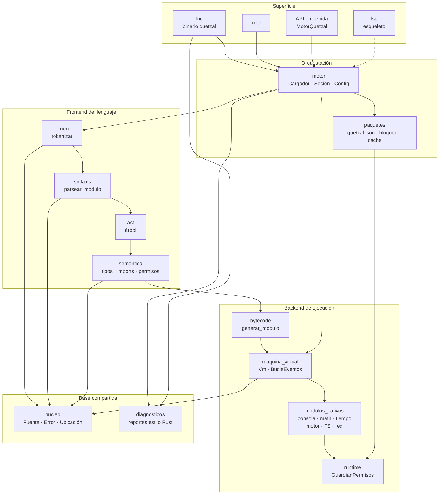
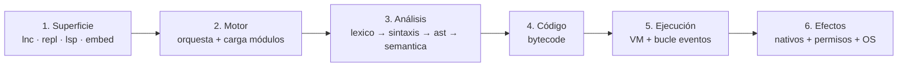
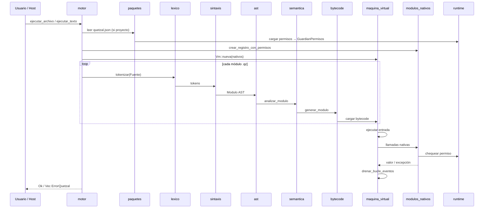
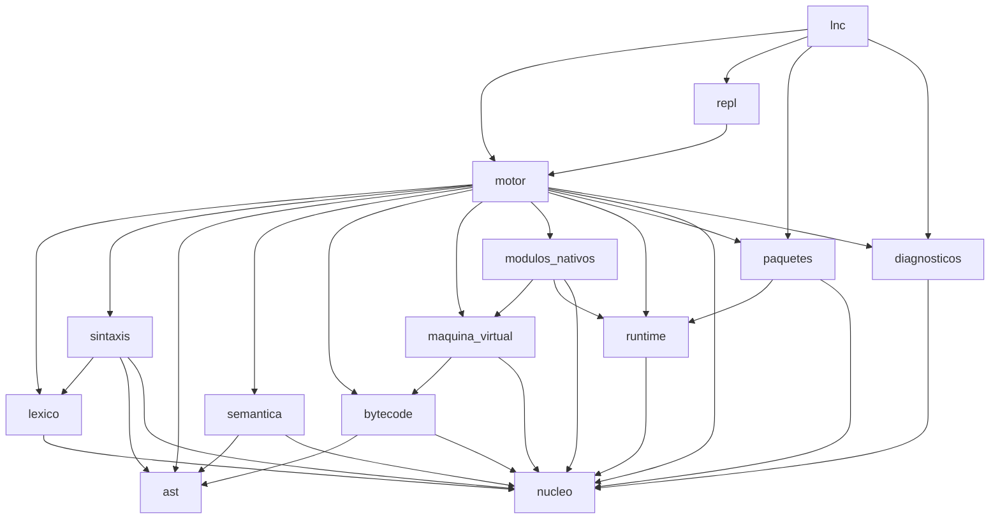
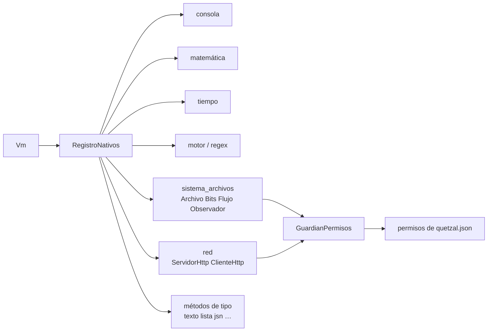
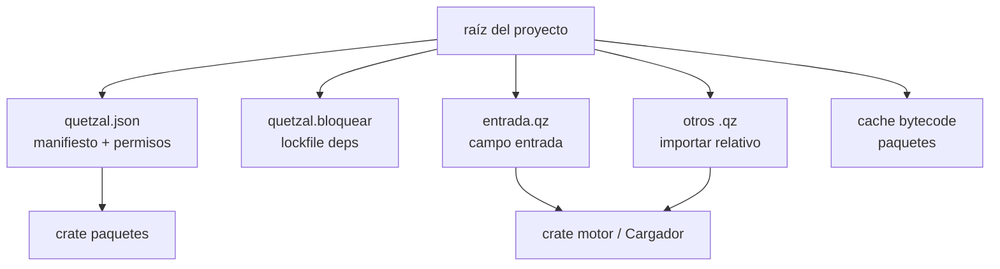
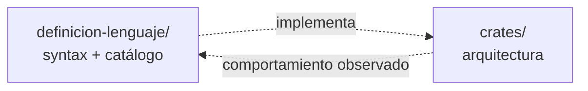

# Arquitectura de Lenguaje Quetzal

> Mapa de crates, pipeline de ejecución y límites de responsabilidad.
> Pareja de sintaxis: [`diagramas.md`](./diagramas.md).
> Identidad: [`identidad.md`](./identidad.md).

```yaml
doc: arquitectura
implementación: Rust workspace
binario: quetzal (crate lnc)
orquestador: motor (MotorQuetzal)
versión_workspace: 0.0.2
```

---

## Objetivo

Documentar **cómo está construido** el intérprete Quetzal (crates + flujo),
para humanos, IA y tooling — no confundir con la gramática del lenguaje.

### Funciones de este documento
- Grafo de capas (CLI → motor → pipeline → VM → stdlib)
- Dependencias entre crates
- Pipeline de un `.qz` hasta efecto (consola / FS / red)
- Límites: qué crate hace qué

### Funciones de la API (punto de entrada)
| Superficie | Crate | Símbolo |
|---|---|---|
| CLI | `lnc` | binario `quetzal` |
| Embebido | `motor` | `MotorQuetzal` |
| REPL | `repl` | `iniciar()` |
| LSP | `lsp` | esqueleto (fases futuras) |

---

## 1. Grafo maestro de arquitectura



---

## 2. Capas (vista vertical)



| Capa | Crates | Responsabilidad |
|---|---|---|
| Superficie | `lnc`, `repl`, `lsp` | CLI, REPL, editor |
| Orquestación | `motor`, `paquetes` | Ejecutar/revisar, manifiesto, deps, cache |
| Análisis | `lexico`, `sintaxis`, `ast`, `semantica` | Fuente → AST tipado |
| Código | `bytecode` | AST → instrucciones |
| Ejecución | `maquina_virtual` | Pila, marcos, async/eventos |
| Efectos | `modulos_nativos`, `runtime` | Stdlib + guardian de permisos |
| Base | `nucleo`, `diagnosticos` | Errores, fuente, reportes |

---

## 3. Pipeline de ejecución (detalle)

Flujo real al llamar `MotorQuetzal::ejecutar_*`:



### Artefactos por etapa

| Etapa | Crate | Entrada | Salida |
|---|---|---|---|
| Léxico | `lexico` | `Fuente` | `Vec<Token>` |
| Parser | `sintaxis` | tokens | `ast::Modulo` |
| Semántica | `semantica` | AST | AST tipado + símbolos + imports |
| Bytecode | `bytecode` | AST | módulo de instrucciones |
| VM | `maquina_virtual` | bytecode + nativos | valores / efectos |
| Nativos | `modulos_nativos` | llamada + args | valor / `Fallo` |
| Permisos | `runtime` | solicitud | permitir / denegar |

---

## 4. Dependencias entre crates (grafo)



**Regla:** flechas = “depende de”. Base = `nucleo`. Orquestador = `motor`.

---

## 5. Crate por crate

| Crate | Objetivo | API pública clave |
|---|---|---|
| `nucleo` | Tipos base compartidos | `Fuente`, `ErrorQuetzal`, `Ubicacion`, `ResultadoQuetzal` |
| `diagnosticos` | Errores legibles (estilo Rust) | `reportar`, `reportar_varios` |
| `lexico` | Fuente → tokens | `tokenizar`, `TipoToken`, `Token` |
| `sintaxis` | Tokens → AST | `Parser`, `parsear_modulo` |
| `ast` | Nodos del árbol | `Modulo`, `Sentencia`, `Expresion`, `DefinicionObjeto`, … |
| `semantica` | Tipos, mutabilidad, imports, permisos estáticos | `analizar_modulo`, `TipoSemantico` |
| `bytecode` | AST → instrucciones | `generar_modulo`, `Instruccion`, `Constante` |
| `maquina_virtual` | Ejecutar bytecode | `Vm`, `BucleEventos`, `RegistroNativos`, valores |
| `runtime` | Permisos en caliente | `GuardianPermisos`, `AccesoSolicitado` |
| `modulos_nativos` | Stdlib ES | `crear_registro_con_permisos`, módulos consola/math/… |
| `paquetes` | Proyecto y deps | `Manifiesto`, `Permisos`, `instalar_dependencias`, cache |
| `motor` | Orquestar todo | `MotorQuetzal`, `ConfiguracionMotor`, `SesionInteractiva` |
| `repl` | Shell interactivo | `iniciar` |
| `lnc` | CLI `quetzal` | comandos ejecutar / revisar / repl / instalar / nuevo |
| `lsp` | Language Server | esqueleto (futuro) |

---

## 6. Stdlib dentro de la VM



Detalle de API: [`modulos-nativos.md`](./modulos-nativos.md) · [`metodos-nativos.md`](./metodos-nativos.md).

---

## 7. Proyecto en disco



Schema: [`esquema_quetzal.json`](./esquema_quetzal.json) · doc: [`manifiesto.md`](./manifiesto.md).

---

## 8. Relación con la especificación del lenguaje

| Pregunta | Documento |
|---|---|
| ¿Qué es Quetzal? | [`identidad.md`](./identidad.md) |
| ¿Qué features/API tiene? | [`catalogo.json`](./catalogo.json) |
| ¿Cómo se escribe? | [`gramatica.json`](./gramatica.json), [`diagramas.md`](./diagramas.md) |
| ¿Cómo está implementado? | **Este archivo** |
| ¿Qué crate toca X? | §5 tabla |



---

## 9. Resumen en una frase

**`lnc`/`repl` llaman a `motor`, que lexea → parsea → tipa → genera bytecode → corre en `maquina_virtual` con `modulos_nativos` bajo `GuardianPermisos` de `runtime`, todo sobre `nucleo` + `diagnosticos`.**
