# Diagramas de Sintaxis — Lenguaje Quetzal

> Diagramas estilo *railroad* (Mermaid) + **grafo de pipeline**.
> Machine/IA: nodos = producciones; aristas = flujo de tokens/AST.
> Canónico: [`identidad.md`](./identidad.md) · [`catalogo.json`](./catalogo.json).

---

## 0. Grafo maestro: pipeline

Cómo se mueve un programa Quetzal (fuente → valor):

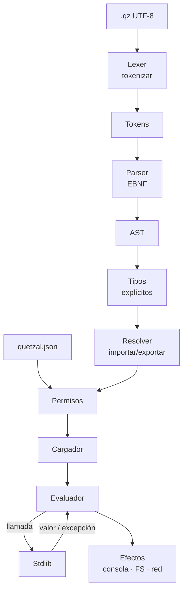

### 0.1 Grafo de categorías sintácticas

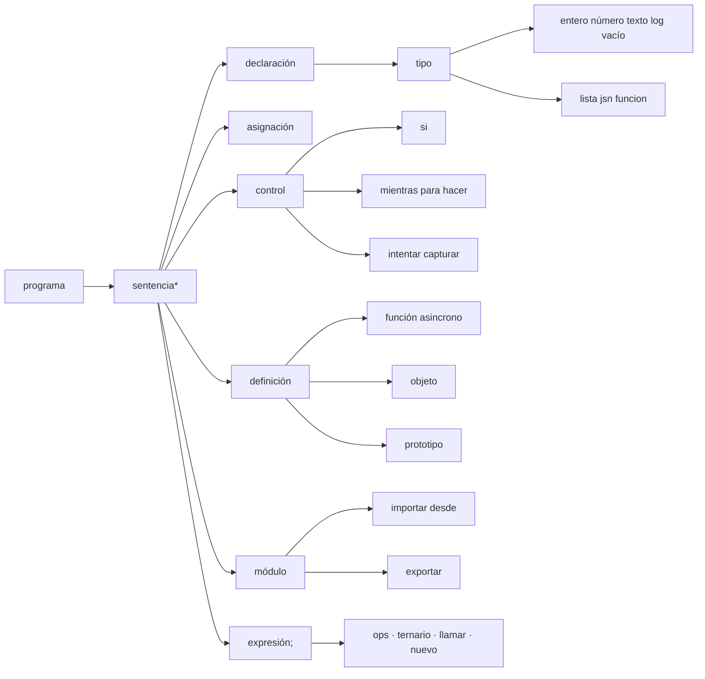

### 0.2 Flujo de una expresión (precedencia)

```mermaid
flowchart BT
    PRIM[primario · literal · id · lista · jsn] --> POST[postfijo . [] call ++ --]
    POST --> UN[unario ! - ++ --]
    UN --> MUL[* / %]
    MUL --> SUM[+ -]
    SUM --> CMP[< <= > >=]
    CMP --> EQ[== !=]
    EQ --> AND[&&]
    AND --> OR[||]
    OR --> TER[? :]
```

---

## 1. Programa (estructura general)

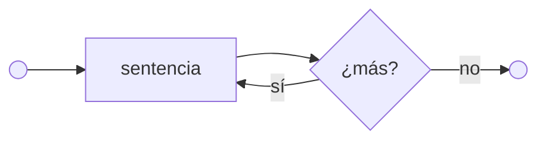

---

## 2. Declaración de variable

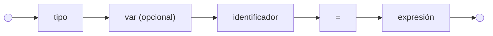

Variantes equivalentes:
```quetzal
entero edad = 41                    // inmutable
texto var nombre = "Ana"           // mutable
número var pi = 3.14
```

---

## 3. Asignación

```mermaid
flowchart LR
    A(( )) --> L["lvalue (id o miembro)"]
    L --> Op{{"+=" | "-=" | "*=" | "/=" | "%=" | "="}}
    Op --> E["expresión"]
    E --> Sc[";"]
    Sc --> Fin(( ))
```

---

## 4. Condicional `si / sino si / sino`

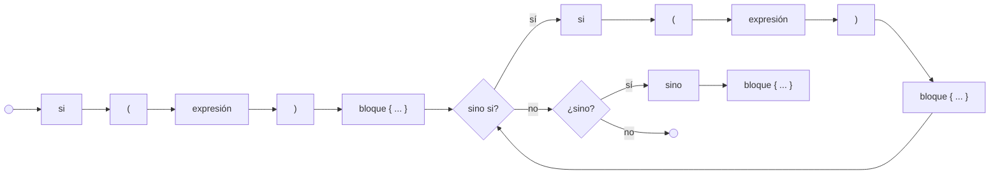

---

## 5. Bucle `mientras`

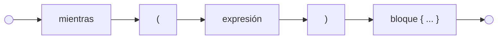

---

## 6. Bucle `hacer ... mientras`

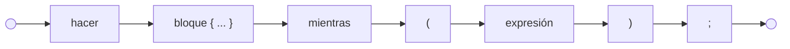

---

## 7. Bucle `para` estilo C

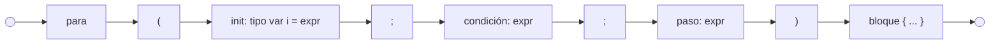

---

## 8. Bucle `para (var x en|cada lista)`

```mermaid
flowchart LR
    A(( )) --> P["para"]
    P --> Lp["("]
    Lp --> T["tipo"]
    T --> Var["var"]
    Var --> ID["identificador"]
    ID --> Kw{{"en" | "cada"}}
    Kw --> Coll["expresión (lista)"]
    Coll --> Rp[")"]
    Rp --> Blk["bloque { ... }"]
    Blk --> Fin(( ))
```

> `en` y `cada` son **sinónimos** y equivalentes en semántica.

---

## 9. Manejo de excepciones `intentar`

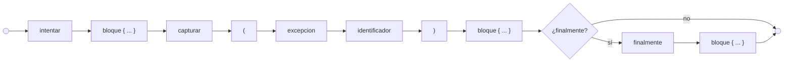

---

## 10. `lanzar` excepción

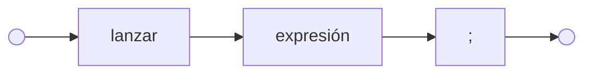

---

## 11. Definición de función

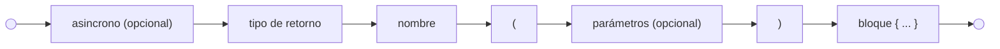

Parámetros:
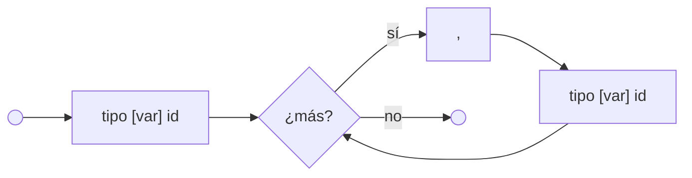

---

## 12. Definición de `objeto` (clase)

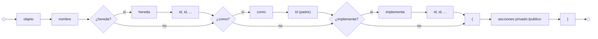

Sección de miembros:
```mermaid
flowchart LR
    A(( )) --> Vis{{"privado" | "publico"}}
    Vis --> D[":"]
    D --> M1["miembro"]
    M1 --> More{"¿más?"}
    More -- sí --> Mn["miembro"]
    Mn --> More
    More -- no --> Fin(( ))
```

---

## 13. Definición de `prototipo` (interfaz)

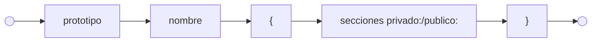

---

## 14. Miembro `libre` (estático)

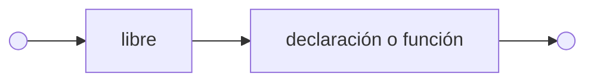

---

## 15. Importar módulo

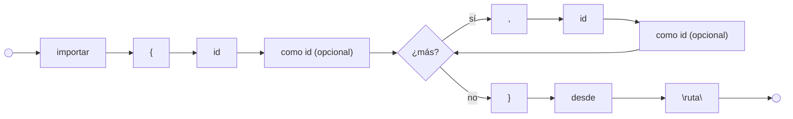

---

## 16. Exportar módulo

```mermaid
flowchart LR
    A(( )) --> Exp["exportar"]
    Exp --> Llave["{"]
    Llave --> It1["id"]
    It1 --> Coma{"¿más?"}
    Coma -- sí --> Co[","]
    Co --> Itn["id"]
    Itn --> Coma
    Coma -- no --> Llave2["}"]
    Llave2 --> Sc[";"]
    Sc --> Fin(( ))
```

---

## 17. Expresión (jerarquía de operadores)

```mermaid
flowchart LR
    A(( )) --> T["ternario (? :)"]
    T --> Or["o (||)"]
    Or --> And["y (&&)"]
    And --> Eq["igualdad (== !=)"]
    Eq --> Cmp["comparación (< <= > >=)"]
    Cmp --> Sum["suma (+ -)"]
    Sum --> Mul["mult (* / %)"]
    Mul --> Un["unario (! - ++ --)"]
    Un --> Post["postfijo (. [] () ++ --)"]
    Post --> Prim["primario"]
    Prim --> Fin(( ))
```

---

## 18. Literal numérico

```mermaid
flowchart LR
    A(( )) --> Dig["dígito+"]
    Dig --> Punto{"¿decimal?"}
    Punto -- sí --> Pt["."]
    Pt --> Dig2["dígito+"]
    Dig2 --> Fin(( ))
    Punto -- no --> Fin
```

---

## 19. Literal de texto (cadena)

```mermaid
flowchart LR
    A(( )) --> Q1["\""]
    Q1 --> Body["caracteres y escapes (\n \t \" \\ \{ \})"]
    Body --> Q2["\""]
    Q2 --> Fin(( ))
```

---

## 20. Literal de texto interpolado (template string)

```mermaid
flowchart LR
    A(( )) --> T["t"]
    T --> Q1["\""]
    Q1 --> Body["texto plano o escapes"]
    Body --> More{"¿más?"}
    More -- sí --> Op{{"texto | {expr}"}}
    Op --> More
    More -- no --> Q2["\""]
    Q2 --> Fin(( ))
```

---

## 21. Literal de lista

```mermaid
flowchart LR
    A(( )) --> Lb["["]
    Lb --> E1["expresión"]
    E1 --> More{"¿más?"}
    More -- sí --> Co[","]
    Co --> En["expresión"]
    En --> More
    More -- no --> Rb["]"]
    Rb --> Fin(( ))
```

---

## 22. Literal de objeto (JSON)

```mermaid
flowchart LR
    A(( )) --> Lb["{"]
    Lb --> K1["clave (cadena o id)"]
    K1 --> Dp[":"]
    Dp --> V1["expresión"]
    V1 --> More{"¿más?"}
    More -- sí --> Co[","]
    Co --> Kn["clave"]
    Kn --> Dpn[":"]
    Dpn --> Vn["expresión"]
    Vn --> More
    More -- no --> Rb["}"]
    Rb --> Fin(( ))
```

---

## 23. Acceso a miembro / llamada a método

```mermaid
flowchart LR
    A(( )) --> P["primario"]
    P --> Op{{". id | [expr] | (args) | ++ | --"}}
    Op --> P
    Op --> Fin(( ))
```

---

## 24. `nuevo` (instanciación)

```mermaid
flowchart LR
    A(( )) --> N["nuevo"]
    N --> ID["identificador"]
    ID --> Lp["("]
    Lp --> Args["argumentos (opcional)"]
    Args --> Rp[")"]
    Rp --> Fin(( ))
```

---

## 25. Diagrama maestro: árbol de decisiones de sentencia

```mermaid
flowchart TB
    S((sentencia)) --> D{¿qué tipo?}
    D -- "tipo + id + =" --> Decl["declaración"]
    D -- "id + op=" --> Asig["asignación"]
    D -- "si / mientras / para / intentar" --> Ctrl["estructura de control"]
    D -- "romper / continuar / retornar" --> Flow["control de flujo"]
    D -- "expr + ;" --> SE["sentencia-expresión"]

    Decl --> D1["tipo [var] id = expr"]
    Asig --> A1["lvalue op= expr ;"]
    Ctrl --> C1{construcción}
    C1 --> C2["si ... sino ... { }"]
    C1 --> C3["mientras (expr) { }"]
    C1 --> C4["hacer { } mientras (expr) ;"]
    C1 --> C5["para (init; cond; step) { }"]
    C1 --> C6["para (tipo var id en expr) { }"]
    C1 --> C7["intentar { } capturar (ex id) { } [finalmente { }]"]
    C1 --> C8["lanzar expr ;"]
```

---

## Cómo usar estos diagramas

- **Pipeline / grafo:** §0 — flujo fuente→runtime y categorías sintácticas.
- **Railroad:** §1–§25 — una producción por diagrama.
- Render: GitHub / GitLab / VS Code Mermaid / Obsidian.
- IA/máquina: emparejar con `gramatica.json` + `catalogo.json`.
- Parser: LR del railroad = orden de tokens; rombos = decisiones.
